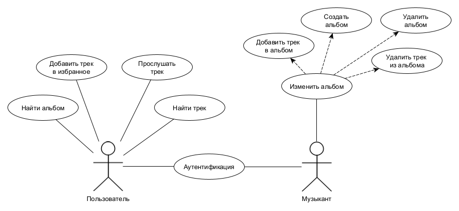
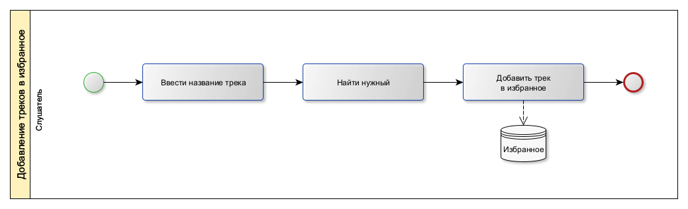

# bmstu-ppo

# Тема: Музыкальный сервис

# Название: Muzyaka

### Цель проекта
Создать приложение, которое предоставляет пользователю возможность авторизоваться и прослушивать треки.
Понравившиеся треки можно добавить в плейлист (избранное).

### Перечень функциональных требований
- Возможность прослушивать треки
- Возможность добавлять треки в понравившиеся
- Музыкант должен иметь возможность загружать треки в систему
- Пользователь должен иметь возможность находить треки

### Use-Case диаграмма

### BPMN

#### Вход в систему

#### Добавление треков в избранное

#### Добавление новых треков

### Пользовательские сценарии

1) Слушатель ищет музыку, которую он еще не слышал.
    
    * Открывает приложение, вводит свои логин и пароль.
    * Вводит название трека.
    * Слушает предложенные треки и добавляет понравившиеся треки в избранное.

2) Молодой музыкант хочет выпустить свой альбом.

    * Регистрируется и получает аккаунт музыканта.
    * Выбирает опцию добавить альбом.
    * Выбирает треки.
    * Загружает альбом

### ER диаграмма

### Диаграмма БД

### Компонентная диаграмма системы

#### Диаграмма компонентов

### Экраны будущего web-приложения
