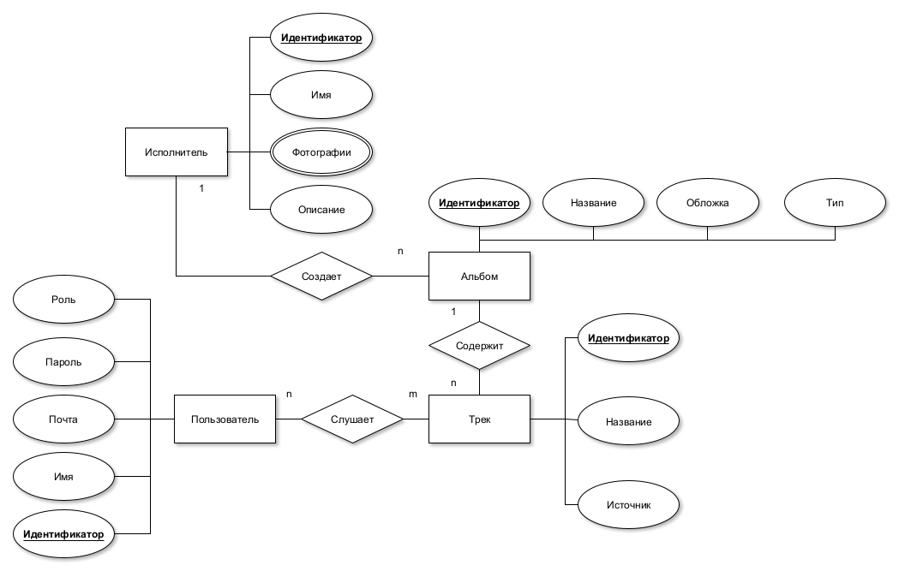
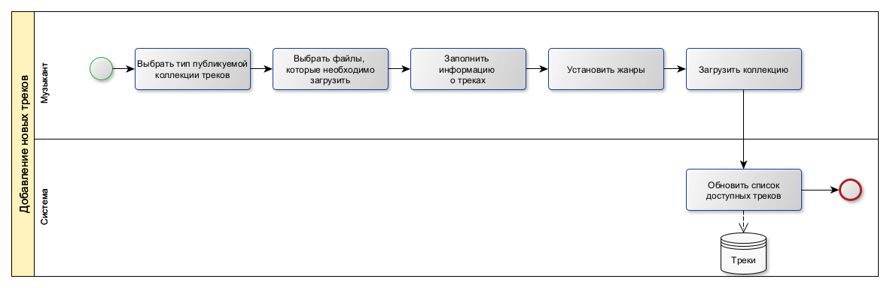

# bmstu-ppo

# Тема: Музыкальный сервис

# Название: Muzyaka

### Идея проекта
Создать приложение, которое предоставляет пользователю возможность авторизоваться и прослушивать треки.
Понравившиеся треки можно добавить в плейлист (избранное).  
Приложение позволяет просматривать события и мерч конкретного исполнителя. В приложении будет рекомендательная система, которая позволяет подобрать треки похожие на заданный.

### Описание предметной области
Предметная область --- приложение музыкального сервиса, включающее: аутентификацию пользователей, добавление новых музыкальных композиций, формирование плейлиста, поиск похожих треков (I2I рекомендательная система). Трек (музыкальная композиция) всегда связана с некоторым альбомом, в крайнем случае с синглом. Трек описывается набором признаков, которые называют эмбеддингом трека (в общем случае не интерпретируемыми), на которых строится аппроксимация KNN для поиска похожих композиций.

### Анализ аналогичных решений

| Решение  | Избранное | События исполнителя | Похожие треки | Доступно в России | Мерч |
|----------|----------|----------| -- | - | - |
| Яндекс Музыка    | +   | + | + | + | - |
| VK музыка    | +   | -   | + | + | - |
| Spotify    | +   | + | + | - | + |
| Разрабатываемое приложение | + | + | + | + | + |

### Целесообразность и актуальность проекта
Музыка занимает важное место в жизни людей, поэтому музыкальные сервисы, позволяющие прослушивать треки и выбирать из них понравившиеся востребованы всегда.

### Акторы
- Обычный пользователь (слушатель) --- роль, которая может только прослушивать треки и не может добавлять новые
- Музыкант --- роль, которая позволяет только добавлять новые треки от своего имени, те не может влиять на треки других ролей
- Администратор --- роль, которая позволяет добавлять и удалять новых пользователей, музыкантов и редактировать все треки.

### Use-Case диаграмма

### ER диаграмма

### Пользовательские сценарии

1) Слушатель ищет музыку, которую он еще не слышал.
    
    * Открывает приложение, вводит свои логин и пароль.
    * Выбирает трек, который ему нравится и нажимает на кнопку <<найти похожие>>.
    * Слушает предложенные треки и добавляет понравившиеся треки в избранное.

2) Молодой музыкант хочет выпустить свой альбом.

    * Регистрируется и получает аккаунт музыканта.
    * Выбирает опцию добавить альбом.
    * Выбирает треки, обложку для альбома и его тип.
    * Загружает альбом

3) Администратор хочет удалить альбом, который нарушает авторские права.

    * Заходит в приложение под аккаунтом администратора.
    * Находит в поиске альбом, который нарушает правила.
    * Выбирает опцию удалить альбом.

### Сложные бизнес правила
1) Аутентификация
2) Рекомендательная система, с поиском похожих треков

### BPMN

#### Вход в систему

#### Поиск похожих треков

#### Добавление новых треков

